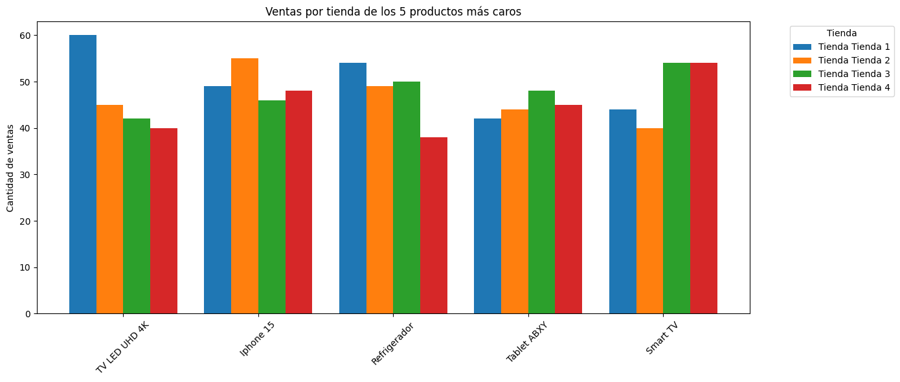
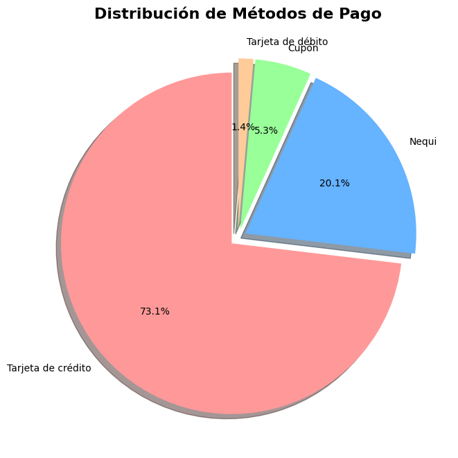
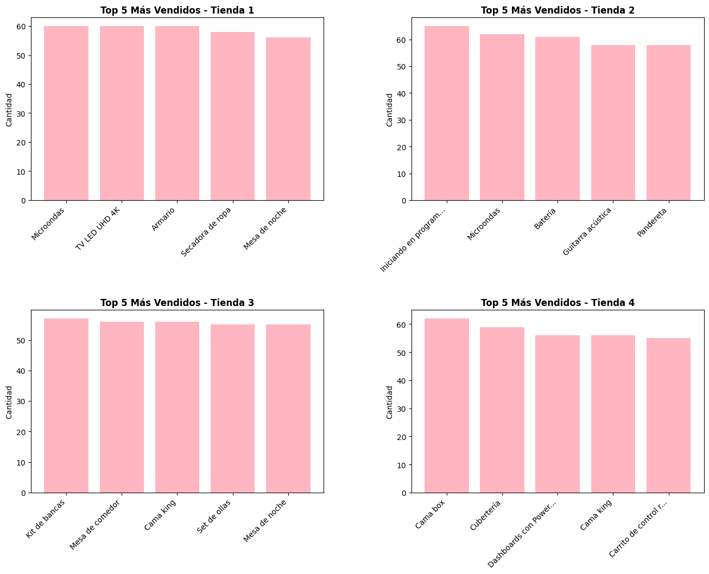

# 🛒 Análisis de Tiendas (Desafío 1 · 2025)


Este proyecto corresponde al **Desafío 1 de la especialización que brinda el programa de Alura Latam 2025**, donde se realiza un análisis completo del rendimiento de cuatro tiendas ficticias utilizando Python, Pandas, Seaborn y Matplotlib.

A través del análisis exploratorio, cálculos estadísticos y visualizaciones, se busca responder una pregunta clave de negocio:

> **¿Qué tienda debería vender el Sr. Juan, considerando ingresos, calificaciones, ventas y costos?**

---

## 📌 Objetivo del Proyecto

El propósito principal es analizar un conjunto de datos con 2.359 registros provenientes de 4 tiendas.
El análisis permite entender:

- Ingresos totales por tienda  

- Categorías de productos más y menos vendidas

- Productos más vendidos

- Calificación por tienda

- Costo de envío 

- Patrones de venta por tienda

- Rendimiento relativo entre tiendas


## 📂 Estructura del Proyecto

```text
📁 desafio1-2025/
│
├── images                           # Imágenes de graficos en formato .png
├── AluraStoreLatam_desafio1.ipynb   # Notebook principal con análisis y gráficos
└── README.md                        # Documentación del proyecto
```

## 🧠 Tecnologías Utilizadas

El proyecto fue desarrollado en **Python** utilizando las siguientes librerías:

* **Pandas:** Manipulación y limpieza de DataFrames.
* **Matplotlib & Seaborn:** Visualización estática (Gráficos de barras, líneas, Boxplots y Heatmaps).
* **Google Colab** (entorno sugerido).

## ⚙️ Instalación y Requisitos

Clonar el repositorio:

```bash
git clone https://github.com/Ayelen95/desafio1-2025.git
cd desafio1-2025
```

Instalar manualmente:

```bash
pip install pandas numpy matplotlib seaborn
```

## ▶️ Cómo Ejecutar el Proyecto


🔹Abrir Google Colab

🔹Subir el archivo .ipynb

🔹Ejecutar todas las celdas (Runtime > Run all).

   **Nota**: El dataset se carga directamente dentro del notebook.

## 📋 Contenido del Análisis

En el notebook encontrarás análisis y visualizaciones sobre:

### ✔ Ingresos totales por tienda

### ✔ Productos más y menos vendidos por tienda

### ✔ Categorías más compradas en cada tienda

### ✔ Calificación por tienda

### ✔ Costo de envío

### ✔ Visualizaciones (barras, heatmaps, comparaciones)

## 📊 Gráficos Realizados:

<div align="center">
  
  <p>Figura 1: Productos más caros vendidos en las Tiendas</p>
</div>

<div align="center">
  
  <p>Figura 2: Métodos de Pagos aplicados en las Tiendas</p>
</div>

<div align="center">
  
  <p>Figura 3: Productos más vendidos por Tiendas</p>
</div>


## 📝 Conclusión del Proyecto

Tras evaluar métricas de rendimiento financiero, satisfacción del cliente, patrones de venta y costos operativos, la recomendación final es:

🚨 Vender la Tienda 4

¿Por qué?

 - Es la tienda con menores ingresos totales.

 - No destaca en calificaciones ni ventas.

 - No presenta picos estacionales importantes.

 - Su rendimiento es consistentemente inferior a sus competidores.

La venta de la Tienda 1 fue descartada debido a su fuerte contribución a los ingresos durante los picos estacionales.


## 👩‍💻 Autora

Ayelén (Angie)
Desarrolladora en formación — Programa Alura Latam 2025

## ⭐ Contribuciones

Las contribuciones son bienvenidas.
Si deseas mejorar gráficos, optimizar código o agregar nuevos análisis, puedes abrir un issue o un pull request.

---

## 🎓 Agradecimientos y Créditos

Este análisis es el resultado del primer desafío técnico del programa **Oracle Next Education**. Agradezco a **Alura Latam** por la formación brindada en lógica de programación y ciencia de datos.
